# Git笔记_v1.7.6

- [Git笔记_v1.7.6](#git笔记_v176)
  - [入门](#入门)
    - [1 安装](#1-安装)
    - [2 git status, git commit等中文信息乱码问题](#2-git-status-git-commit等中文信息乱码问题)
    - [3 本地git与远程github保持登录联通](#3-本地git与远程github保持登录联通)
    - [4 本地创建git项目与远程项目进行关联](#4-本地创建git项目与远程项目进行关联)
  - [进阶](#进阶)
    - [1 git优势](#1-git优势)
    - [2 git三种状态](#2-git三种状态)
    - [3 设置用户和邮箱](#3-设置用户和邮箱)
    - [4 将某个目录纳入 git 管理](#4-将某个目录纳入-git-管理)
    - [5 git log](#5-git-log)
    - [6 删除用户配置信息](#6-删除用户配置信息)
    - [7 已提交的文件-修改后-撤销回滚](#7-已提交的文件-修改后-撤销回滚)
    - [8 工作区文件 -> 暂存区后：撤销 add 操作](#8-工作区文件---暂存区后撤销-add-操作)
    - [9 提交问题与用户邮箱配置](#9-提交问题与用户邮箱配置)
    - [10 删除已提交到对象区（即分支区）的文件](#10-删除已提交到对象区即分支区的文件)
    - [11 撤销已提交文件的删除](#11-撤销已提交文件的删除)
    - [12 重命名文件](#12-重命名文件)
    - [13 注释重写提交说明](#13-注释重写提交说明)
    - [14 忽略文件：.gitignore](#14-忽略文件gitignore)
    - [15 通配符](#15-通配符)
    - [16 分支](#16-分支)
    - [17 分支-提交链（分支合并与冲突）](#17-分支-提交链分支合并与冲突)
  - [常见错误](#常见错误)
    - [1 ssh: connect to host github.com port 22: Connection timed out](#1-ssh-connect-to-host-githubcom-port-22-connection-timed-out)

---

## 入门

git命令行操作跟Linux一样

### 1 安装

1. Use git from git bash only..., 其他默认下一步
2. 查看环境变量配置, 没有则手动配置, path: E:\programs\Git\bin
3. 配置git, 桌面右键git bash..., 配置用户名和邮箱

    ```git
    git config --global user.name hua
    git config --global user.email "2827890646@qq.com"
    ```

该配置文件在本地计算机c:\user\用户\.gitconfig

### 2 git status, git commit等中文信息乱码问题

```git
git config --global gui.encoding utf-8
git config --global i18n.commitencoding utf-8
git config --global core.quotepath false
git config --global svn.pathnameecoding utf-8
```

### 3 本地git与远程github保持登录联通

git 的远程仓库托管网站目前就[github](https://github.com)一个常用

为了在本地和远程仓库之间进行操作, 可采取免密钥登录,配置 .ssh 先在本地配置, 然后把公钥发送给远程仓库github.

1. 在本地git命令行中输入:

    ```git
    ssh-keygen -t rsa -C 2827890646@qq.com
    ```

2. 然后一直回车, 出现下图则表示成功

    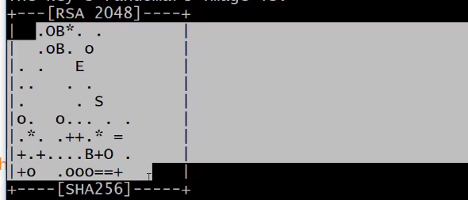

3. 发送给远程github

    1. github -> settings -> SSH and ... -> New SSH -> title & key

        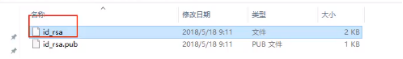

    2. 复制本地公钥到key中, 删掉最后的回车占位符
    3. 如果本地和远程成功通信, 则在本地./ssh目录中自动生成**known-hosts**文件
    4. 测试本地仓库与远程仓库的登录连通性, git命令行:

        ```git
        ssh -T git@github.com
        ```

### 4 本地创建git项目与远程项目进行关联

本地创建git项目与远程项目进行关联时，要保持本地电脑PC端github账号登录状态。（一般是本地电脑，这个跟ssh配置有关。ssh配置指向其他地址，则其他地址上的github账号保持登录状态即可）[参考本地git与远程github保持登录联通](#3-本地git与远程github保持登录联通)

1. 先创建一个目录demo
2. 进入该目录,鼠标右键点击git bash..., 打开git命令端, 输入 `git init`, 会自动在demo目录下生成 **.git**目录(该目录是隐藏的).
3. github上创建一个Repository.

    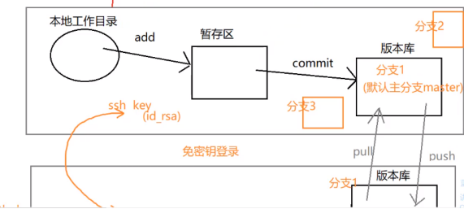

4. 第一次发布项目(本地 -> 远程)

    ```git
    git init
    git add . // 文件 -> 暂存区, "." 表示当前目录下的所有文件提交暂存区
    git commit -m "第一次提交"  // 暂存区 -> 本地分支(默认为master)
    git remote add origin <远程项目所在的ssh地址(或http协议地址)>
    git push -u origin master // 本地分支 -> 远程项目
    ```

5. 第一次下载项目(远程 -> 本地)

    本地创建一个目录, 进入该目录, 打开git命令终端, 输入下面命令:

    ```git
    git clone git@github.com:yanse/mygitdemo.git
    ```

6. 非第一次提交(本地 -> 远程)

    ```git
    git add .
    git commit -m "第二次提交"
    git push origin master // 注意: 这里去掉了 -u (其实可以简写成git push)
    ```

7. 更新(远程 -> 本地)

    1. 在远程项目中修改文件.

        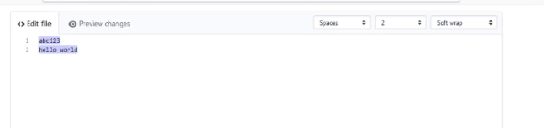

    2. 本地项目中, git命令行输入 `git pull` 即可更新.

## 进阶

### 1 git优势

1. 本地版本控制；
2. 重写提交说明
3. 每次操作都可以回滚，还原；
4. 分支系统，分布式。

### 2 git三种状态

1. 已修改（modified）
2. 已暂存（staged）
3. 已提交（committed）

### 3 设置用户和邮箱

Git 自带一个 git config 的工具来帮助设置控制 Git 外观和行为的配置变量。这些变量存储再三个不同的位置：

1. **/etc/gitconfig** 文件：包含系统上每一个用户及他们仓库的通用配置。如果在执行 git config 时带上 **--system** 选项，那么它就会读写该文件中的配置变量。（由于它是系统配置文件，因此你需要管理员吧或超级用户权限来修改它。）

2. **~/.gitconfig 或 ~/.config/git/config** 文件：只针对当前用户。你可以传递 **--global** 选项让 Git 读写此文件，这会对你的系统上所有的仓库生效。

3. 当前使用仓库的 Git 目录中的 config 文件（即 **.git/config**）：针对该仓库。你可以传递 **--local** 选项让 Git 强制读写此文件，虽然默认情况下的就是它。（当然，你需要进入某个 Git 仓库中才能让该选项生效。）

每一个级别会覆盖上一个级别的配置，所以，**.git/config** 的配置变量会覆盖 **/etc/gitconfig** 中的配置变量。

### 4 将某个目录纳入 git 管理

```git
git init // 此时，git 命令行中显示master，项目目录下自动生成 .git 文件夹。（.git：负责版本控制的目录）
git rm --cached <file> // 暂存区 -> 工作区
git commit // 进入 vi 操作界面，写提交的备注，适合较长的备注（简写：git commit -m "备注内容"）
```

已提交到对象区（分支区），然后修改该已提交的文件，此时，这个文件会退回到工作区；如果还想提交的话，再经历一次操作：工作区 - > 暂存区 -> 对象区（分支区）；如果想撤销修改，可执行git命令：

```git
git checkout -- <file>
```

### 5 git log

1. 查看提交日志，会发现如下内容：

    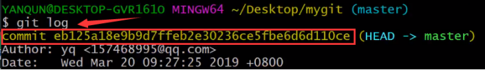

    commit 后面的那一串字符：**sha1** 计算的结果。

    sha1、md5：加密算法、随机数，用于区分是哪一次提交。

2. 自定义查看日志

    ```git
    git log -2 // 2：指最近的2次提交
    git log --pretty=online
    git log --pretty=format:"%h -%an, %ar : %s"
    ```

### 6 删除用户配置信息

1. 找到 .gitconfig 文件直接删掉（最直接）
2. 或通过命令删除

    ```git
    git config --global(或 --system 或 --local) --unset user.name
    git config --global(或 --system 或 --local) --unset user.email
    ```

### 7 已提交的文件-修改后-撤销回滚

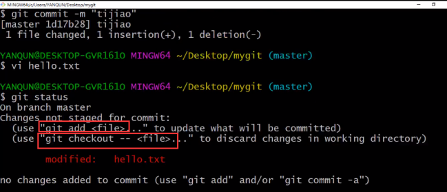

如果某个文件，已提交，并对其进行了修改，可以放弃修改（还原到已提交状态）。

```git
git checkout -- <file>
```

### 8 工作区文件 -> 暂存区后：撤销 add 操作

```git
git reset HEAD <file>
```

小结

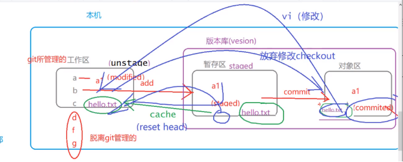

### 9 提交问题与用户邮箱配置

场景：第一个邮箱用户git提交了文件，第二个邮箱用户（把第一个邮箱用户改成第二个的）在同一个本地环境（跟第一个用户环境保持一致，就用第一个的项目，说白了就是改了个邮箱用户名而已，其他都没变）的项目中进行git提交操作（如新建了一个文件，修改了文件后提交到对象区）。此时，git log查看到，之前的配置没变，记录此次的配置。

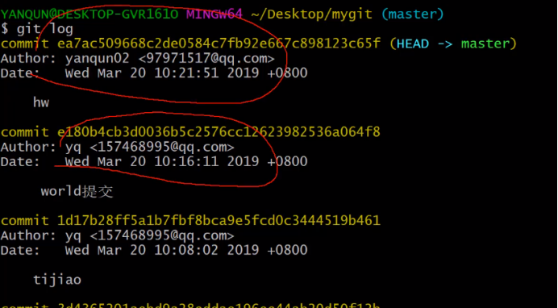

### 10 删除已提交到对象区（即分支区）的文件

1. git rm 操作删除：删除 -> 在暂存区

    ```git
    git rm <file>
    ```

    删除之后的文件会被放到暂存区，如果想彻底删除，在输入 git 命令：

    ```git
    git commit -m "彻底删除"
    ```

2. 操作系统删除 rm ：删除 -> 工作区

    ```git
    rm <file>
    git add .
    git commit -m "彻底删除"
    ```

### 11 撤销已提交文件的删除

1. 对象区（分支区）- `git rm < file >` ->
2. 暂存区 - `git reset HEAD < file >` -> (注意：这里抛出了delete信息)
3. 工作区 - `git checkout -- < file >`

### 12 重命名文件

1. git命令的文件重命名

    git 文件的重命名的内部执行流程：首先新建一个文件，把源文件内容拷贝进去，然后再删掉源文件。

    ```git
    git mv <file1> <file2>
    git status // renamed: <file1> -> <file2>
    git reset HEAD <file1> // new file: <file2>, deleted: <file1>
    git checkout -- <file1>
    ls // <file1>、<file2>都在
    git status // new file: <file2>，可提交 -> 对象区， 也可撤销 -> 工作区
    ```

2. 操作系统命令的文件重命名

    ```git
    mv <file1> <file2>
    git status // deleted: <file1>, untracked files: <file2>
    git add .
    git commit -m "操作系统命令的重命名"
    git status // 每次操作可以用此命令查看文件的状态，定位文件所在哪个区，需执行的可操作提示
    ```

### 13 注释重写提交说明

**git log** // 出现冒号，按 q 退出模式

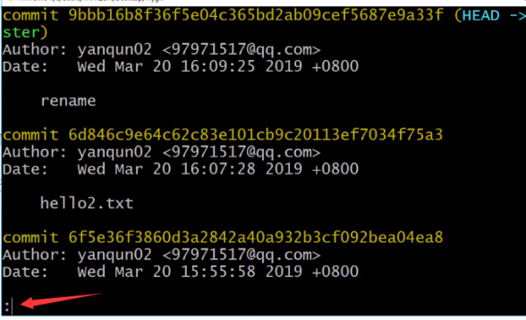

修改最近一次提交的备注信息：`git commit --amend -m "备注内容"`

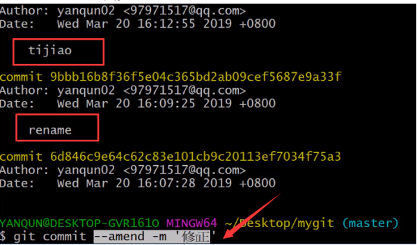

### 14 忽略文件：.gitignore

git 项目中，提交前，先忽略不需要提交的文件，再把剩下的提交到对象区（分支区）。

在 git 项目根目录下创建 **.gitignore** 文件，编辑内容 `vi .gitignore`

```vi
a.properties // 列出忽略提交的文件即可
```

保存该 **.gitignore** 文件，接着，退出 vi 编辑模式，返回 git 命令行，输入 git status
查看文件状态，该项目列表中已经没有了 a.properties 文件，它被忽略了。

### 15 通配符

使用场景：如 **.gitignore** 文件编写需要排除的文件。以下是常见的通配符：

1. *：匹配任意字符。

2. *.xxx：匹配后缀 .xxx 的文件中。

3. !xx.xxx：在后缀 .xxx 的文件中，排除 xx.xxx 文件，结合 *.xxx 使用。

4. dir(目录)/ ：忽略 dir 中的所有文件。

5. dir(目录)/*/*.xxx：能够忽略如 dir/t1/a.xxx, dir/t2/b.xxx，但不能忽略含2级以上的目录中的 *.xxx文件（如：dir/a/b/j.xxx），这跟通配符 <*> 有关。

6. dir/**/*.xxx：忽略任意级别目录中的 *.xxx文件。

7. git 项目中创建的**空目录**，默认自动忽略，git status 查不到此目录信息。

### 16 分支

1. 查看分支：`git branch`

2. 创建分支：`git branch <分支名>`

3. 切换分支：`git checkout <分支名>`

4. 删除分支：`git branch -d <分支名>`

    1. 自己不能删除自己（当前分支），可切换主分支master，再删除当前分支。

    2. 如果要被删除的分支，包含“未合并”的内容，切换到master进行删除会报错。建议先合并再通过master删除。

        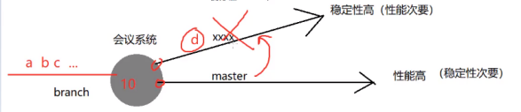

5. 创建新分支并切换到该分支：`git checkout -b <分知名>`，结合 **4.** 进行操作：

    ```git
    // 场景：git项目已存在文件
    git checkout -b new_branch
    git rm *.xxx // 删除 *.xxx 文件
    git commit -m "delete files: *.xxx" // 在 new_branch 分支中没有了 *.xxx文件
    git checkout master // 分支new_branch 删除的 *.xxx 文件在主分支 master 中仍存在，此时没有受到 new_branch 操作影响，注意这里，已经切换到了 master
    git branch -d new_branch // 报错，没删掉 new_branch 分支，并且提示 new_branch 需要合并（merge）到master，才能通过master删掉 new_branch。
    git merge new_branch // new_branch 合并到 master，注意观察 new_branch 之前删除的 *.xxx在 master 中没有了。
    git branch -d new_branch // 成功删除分支 new_branch
    ```

    **Tips**
    强行删除分支：`git branch -D <分支名>`

6. 查看分支最近提交（commit）的 **sha1**值：`git branch -v`

    **细节问题**

    1. 如果在非主分支中，file1 文件进行了写操作（即增删改），但此操作局限在工作区中进行（没有add、commit）。在 master 中能够看到该操作。

    2. 如果在非主分支中，file1 文件进行了写操作（即增删改），并且add，commit。在 master 中无法观察改操作，看不到 file1 文件。（问点：非主分支主动合并 master，或主分支 master 合并非主分支，观察 file1 状态）

    3. 如果在非主分支中， file1 文件进行了写操作（即增删改），但此操作局限在工作区中进行（没有add，commit）。在 master 中删除该非主分支，可直接删除。

    4. 如果在非主分支中，file1 文件进行了写操作（即增删改），并且add，commit。在 master 中无法删除该非主分支。

### 17 分支-提交链（分支合并与冲突）

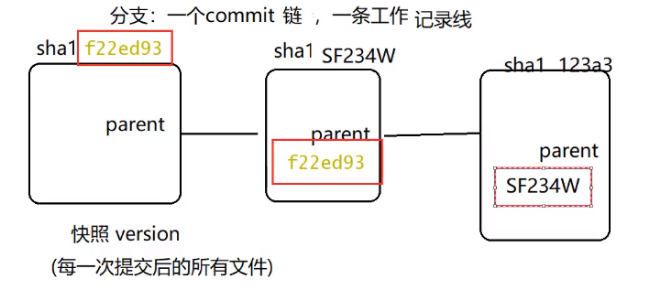

分支名（master）：指向当前的提交（commit）
HEAD：指向当前分支（HEAD -> 分支名）

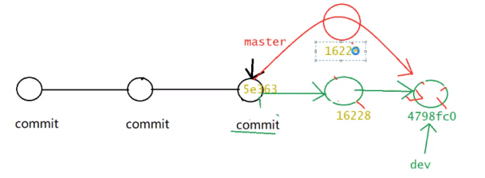

```git
// 场景：git 空项目，分支合并
git init
git checkout -b dev // 当前分支 dev，指向：HEAD -> dev
cd .git
ls // HEAD位置：.git -> HEAD
cat HEAD // ref：refs/heads/dev
cd ..
cd ..
git log // 查看 sha1 值 HEAD -> dev，master
vi a.txt //编辑内容：a，保存，退出 vi 模式，返回 git 命令
git add .
git commit -m “dev1”
git log // 观察 dev 的 sha1 值 -> dev1，此时，分支 dev 领先 master 一步
vi a.txt // 修改内容
git add .
git commit -m "dev2"
git log // 观察 dev 的 sha1 值 -> dev2，此时，分支 dev 已经领先 master 两步了
.....未完待续
```

## 常见错误

### 1 ssh: connect to host github.com port 22: Connection timed out

解决方法:

打开目录.ssh

```git
cd ~/.ssh
ls
```

查看是否存在 id_rsa   id_rsa.pun  known_hosts 三个文件, 如果没有则参考ssh本地关联远程github

1. vi config(进入vi编辑界面)
2. insert模式

    ```vi
    Host github.com
    User YourEmail@qq.com
    Hostname ssh.github.com
    PreferredAuthentications publickey
    IdentityFile ~/.ssh/id_rsa
    port 433
    ```

其中,YourEmail为申请github账号所绑定的邮箱.

保存之后再次执行"ssh -T git@github.com"时, 会出现如下提示, 一路回车"yes"即可.
